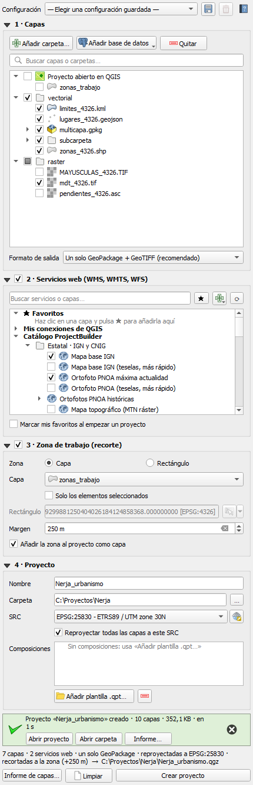
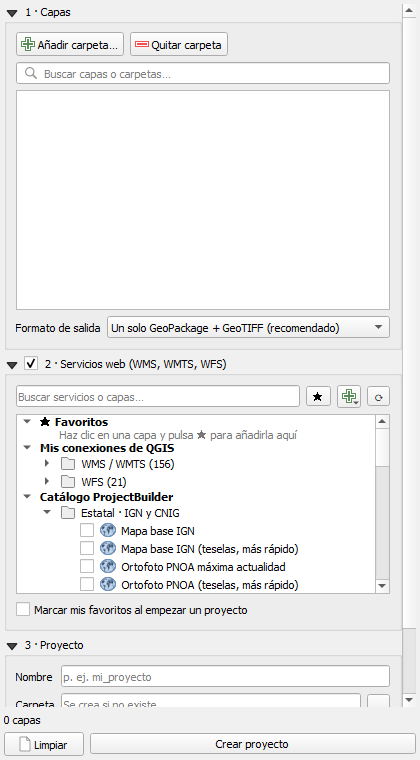

# ProjectBuilder

Plugin de QGIS que crea un proyecto (`.qgz`) a partir de una selección de capas locales y servicios WMS.
Las capas se **copian y reproyectan** al SRC elegido dentro de la carpeta del proyecto, conservando la
estructura de subcarpetas y sus estilos `.qml`.

- Compatible con **QGIS 3.34+ y QGIS 4.x**
- Formatos vectoriales: Shapefile, GeoPackage, SpatiaLite, GeoJSON, KML, GML, FlatGeobuf, MapInfo, DXF y GPX
- Formatos ráster: GeoTIFF, ECW, JPEG2000, ASCII Grid, IMG, VRT, PNG/JPG georreferenciados y MrSID
- Capas de varias carpetas a la vez; cada carpeta de origen se convierte en un grupo del proyecto
- Formato de salida a elegir: un solo GeoPackage + GeoTIFF (recomendado), un GeoPackage por capa o conservar el original
- Servicios web WMS, WMTS y WFS: tus **favoritos**, tus **conexiones de QGIS** y un **catálogo** de servicios oficiales (IGN, Catastro, IGME, comunidades)
- Exportación en segundo plano, con progreso y cancelación

## Uso


1. **Capas**: pulsa *Añadir carpeta…* (tantas veces como orígenes necesites) y marca las capas o carpetas (☑) que quieras incluir. Usa la caja de búsqueda para filtrar; los GeoPackage se despliegan para elegir capas sueltas.
   *Quitar carpeta* elimina del árbol la carpeta en la que hayas hecho clic. Elige el **formato de salida**.
2. **Servicios web** (opcional): marca la casilla de la sección *2 · Servicios web* y marca las capas. Despliega un servicio para ver sus capas;
   pulsa **★** sobre una capa para guardarla en Favoritos, y **+** para crear una conexión nueva en QGIS.

   
3. **Proyecto**: nombre, carpeta de destino (se crea si no existe; no puede ser ninguna de las de origen ni estar dentro de ellas) y SRC.
   Por defecto **todas las capas se reproyectan a ese SRC**; si desmarcas la casilla, cada capa conserva su SRC original y QGIS las reproyecta al vuelo.
4. Revisa el resumen bajo el formulario (capas, WMS, formato y ruta del `.qgz`) y pulsa **Crear proyecto**. Al terminar, el mensaje verde permite abrirlo directamente. **Limpiar** vacía el formulario para preparar otro proyecto.

Las capas se añaden ocultas para que el proyecto abra rápido.

## Añadir servicios
Lo más sencillo: crea la conexión en QGIS (botón **+**) y marca sus capas con **★**.
Para ampliar el catálogo del plugin, edita `services.json`: cada grupo tiene `nombre` y `servicios`; cada servicio, `name`, `url`,
`type` (`wms`, `wmts` o `wfs`) y opcionalmente `layer` (si se omite, el servicio se despliega para elegir capa).

## Desarrollo
Ver [`docs/DESARROLLO.md`](docs/DESARROLLO.md). Prueba rápida desde la consola de Python de QGIS:
```python
exec(open(r"RUTA\ProjectBuilder\tests\smoke_test.py", encoding="utf-8").read())
```

## Autor y licencia
Francisco Gómez Losada · pgomezlosada@gmail.com · GNU GPL v2 o posterior.
Origen: Trabajo Fin de Máster (2023).
