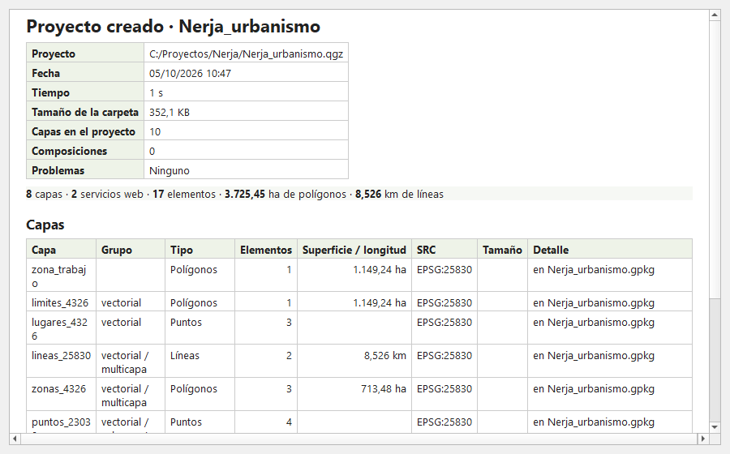

# ProjectBuilder

**Configurador integral de proyectos de QGIS: de tus capas y servicios a un proyecto listo para trabajar, en un minuto.**
*All-in-one QGIS project builder: from your layers and web services to a ready-to-work project, in a minute.*

 

[Español](#español) · [English](#english)

---

## Español

Empezar un proyecto SIG suele ser media mañana de tareas repetitivas: buscar las capas, copiarlas, reproyectarlas, recortarlas a la zona de estudio, cargar los estilos, añadir la ortofoto y el catastro, preparar la composición de impresión… **ProjectBuilder lo hace todo de una vez.**

Eliges en un solo panel qué capas, bases de datos y servicios web necesitas, la zona de trabajo y el sistema de referencia, y el plugin **empaqueta, reproyecta, recorta y organiza** todo en un proyecto `.qgz` **autónomo**: una carpeta con sus datos, estilos e iconos que se abre al instante, se puede mover a otro ordenador o enviar a un compañero, y se ve exactamente igual.

### Por qué usarlo
- ⏱️ **Ahorra tiempo**: lo que antes eran decenas de pasos manuales, ahora es marcar casillas y pulsar *Crear proyecto*. Y si haces a menudo el mismo tipo de proyecto, lo guardas como **configuración** y lo repites con un clic.
- 📦 **Todo en un paquete**: las capas vectoriales en **un solo GeoPackage** (o uno por capa, o en su formato original) y los ráster en GeoTIFF comprimido, con sus **estilos** y los **iconos SVG** que usan. El proyecto no depende de las carpetas de origen.
- 🌐 **Reproyecta** todas las capas al SRC del proyecto (por ejemplo, ETRS89 / UTM 30N), vengan como vengan.
- ✂️ **Prepara la zona de trabajo**: recorta todas las capas (vectoriales y ráster) por un polígono, sus elementos seleccionados o un rectángulo, con un margen en metros. El proyecto se abre centrado en la zona y los WFS solo descargan esa zona.
- 🗺️ **Servicios web listos**: WMS, WMTS y WFS de tus favoritos, tus conexiones de QGIS o un **catálogo de servicios oficiales españoles** (IGN, Catastro, IGME, comunidades autónomas) que se revisa solo.
- 🖨️ **Composiciones de impresión** del proyecto abierto o de plantillas `.qpt`, con los mapas ya centrados en la zona.
- 📊 **Informes**: antes de crear el proyecto, cada capa con sus elementos, superficie o longitud, SRC y tamaño (ya recortada a la zona); al terminar, qué se ha creado, cuánto ocupa y cuánto ha tardado. En PDF, HTML o CSV.

### De dónde puede venir cada capa
- **Carpetas de tu ordenador o de la red**: Shapefile, GeoPackage, SpatiaLite, GeoJSON, KML, GML, FlatGeobuf, MapInfo, DXF y GPX; GeoTIFF, ECW, JPEG2000, ASCII Grid, IMG, VRT, PNG/JPG georreferenciados y MrSID. Puedes **arrastrarlas** al panel desde el Explorador o el Navegador de QGIS.
- **El proyecto abierto en QGIS**, con sus mismos grupos y su estilo actual.
- **Bases de datos PostGIS, SpatiaLite y GeoPackage** de tus conexiones de QGIS: se descarga solo lo que cae en la zona de trabajo y se conserva el estilo guardado en la base de datos.
- **Servicios web** WMS, WMTS y WFS.

Compatible con **QGIS 3.34+ y QGIS 4.x**, en Windows, Linux y macOS. Sin dependencias externas. Todo se hace en segundo plano, con progreso y cancelación.

### Instalación
- Desde QGIS: *Complementos → Administrar e instalar complementos*, busca **ProjectBuilder**.
- O descarga el ZIP de [Releases](https://github.com/FGomezLosada/ProjectBuilder/releases) y usa *Instalar a partir de ZIP*.

### Uso
**Configuración** (arriba): elige una configuración guardada para rellenar el panel de una vez, o guarda la actual con 💾. El botón **?** abre esta guía.

1. **Capas**: arriba del árbol aparecen las del **proyecto abierto en QGIS**. Pulsa *Añadir carpeta…* (tantas veces como orígenes necesites) o *Añadir base de datos*, o **arrastra carpetas y ficheros** al panel, y marca lo que quieras (☑). Al pasar el ratón por una capa ves su SRC, sus elementos y su tamaño; con **doble clic** (o clic derecho → *Ver en el mapa*) el mapa va a ella. Elige el **formato de salida**.
2. **Servicios web** (opcional): activa la sección y marca las capas. Despliega un servicio para ver sus capas; **★** guarda una capa en Favoritos y **+** crea una conexión nueva en QGIS.
3. **Zona de trabajo** (opcional): una capa de polígonos (o solo sus elementos seleccionados) o un rectángulo (extensión del mapa, de una capa o dibujado), y un margen en metros.
4. **Proyecto**: nombre, carpeta de destino (se crea si no existe), SRC y composiciones de impresión. En el cajetín de la composición puedes usar `[% @project_title %]`: se rellena con el nombre del proyecto.
5. Revisa el resumen (o pulsa **Informe de capas…**) y pulsa **Crear proyecto**. Al terminar, el panel muestra el resultado con botones para **abrir el proyecto**, **abrir su carpeta** o ver el **informe** completo. **Limpiar** vacía el formulario.

### Servicios siempre al día
El plugin comprueba sus servicios una vez por semana, en segundo plano: los que no responden se desactivan temporalmente (⛔), corrige los cambios de dirección más habituales y descarga el catálogo más reciente de este repositorio.

### Desarrollo
Ver [`docs/DESARROLLO.md`](docs/DESARROLLO.md) y el [historial de versiones](CHANGELOG.md). Pruebas: doble clic en `tools\probar.bat` (las lanza todas en QGIS 3.40 y 4, cada una en un QGIS sin ventana). El ZIP para publicar se genera con `python tools/package.py`.
Errores e ideas: [Issues](https://github.com/FGomezLosada/ProjectBuilder/issues).

### Autor y licencia
- **Autor:** Francisco Gómez Losada · pgomezlosada@gmail.com
- **Colaborador:** Mikel Febrer (MFGeo), tutor del Trabajo Fin de Máster, que guio y ayudó a desarrollar las primeras versiones del plugin.
- **Origen:** Trabajo Fin de Máster (2023) de la 1.ª edición del [Máster en Sistemas de Información Geográfica de Código Abierto](https://geoinnova.org/curso/master-sig-codigo-abierto/) de Geoinnova.
- **Licencia:** [GNU GPL v2 o posterior](LICENSE).

---

## English

Starting a GIS project usually means a morning of repetitive work: finding the layers, copying them, reprojecting them, clipping them to the study area, loading styles, adding the orthophoto and the cadastre, preparing the print layout… **ProjectBuilder does it all at once.**

In a single panel you pick the layers, databases and web services you need, the work area and the CRS, and the plugin **packages, reprojects, clips and organises** everything into a **self-contained** `.qgz` project: one folder with its data, styles and icons that opens instantly, can be moved to another computer or sent to a colleague, and looks exactly the same.

- ⏱️ **Saves time**: tick the boxes and click *Create project*. Save the form as a **configuration** to repeat the same kind of project with one click.
- 📦 **Everything in one package**: vector layers in **a single GeoPackage** (or one per layer, or their original format), rasters as compressed GeoTIFF, with their **styles** and the **SVG icons** they use.
- 🌐 **Reprojects** every layer to the project CRS.
- ✂️ **Prepares the work area**: clips every layer (vector and raster) to a polygon, its selected features or a rectangle, with a buffer in metres. The project opens on the area and WFS layers only download that area.
- 🗺️ **Web services ready**: WMS, WMTS and WFS from your favourites, your QGIS connections or a built-in, automatically checked **catalogue of Spanish public services** (IGN, Cadastre, IGME, regional SDIs).
- 🖨️ **Print layouts** from the open project or `.qpt` templates, centred on the work area.
- 📊 **Reports** before and after: each layer's features, area or length, CRS and size; what was created, its size and how long it took. As PDF, HTML or CSV.

Layers can come from local or network folders (drag and drop them onto the panel), from the open QGIS project, from **PostGIS, SpatiaLite and GeoPackage** connections, and from web services. Works with **QGIS 3.34+ and 4.x** on Windows, Linux and macOS, with no external dependencies; everything runs in the background.

The user interface is in Spanish. Install it from *Plugins → Manage and Install Plugins* (search for *ProjectBuilder*) or download the ZIP from [Releases](https://github.com/FGomezLosada/ProjectBuilder/releases) and use *Install from ZIP*. Bug reports and ideas are welcome in [Issues](https://github.com/FGomezLosada/ProjectBuilder/issues).

Author: Francisco Gómez Losada. Contributor: Mikel Febrer (MFGeo), master's thesis supervisor, who guided and helped build the first versions. Born as the master's thesis (2023) of the 1st edition of Geoinnova's [Master in Open Source Geographic Information Systems](https://geoinnova.org/curso/master-sig-codigo-abierto/). Licence: [GNU GPL v2 or later](LICENSE).
