# Manual de ProjectBuilder

Guía completa del plugin, función por función. Para una presentación rápida, ver el [README](../README.md).

**Contenido**
1. [Instalación y primer uso](#1-instalación-y-primer-uso)
2. [El panel de un vistazo](#2-el-panel-de-un-vistazo)
3. [Configuraciones guardadas y cómo compartirlas](#3-configuraciones-guardadas-y-cómo-compartirlas)
4. [Sección 1 · Capas](#4-sección-1--capas)
5. [Sección 2 · Servicios web](#5-sección-2--servicios-web)
6. [Sección 3 · Zona de trabajo](#6-sección-3--zona-de-trabajo)
7. [Sección 4 · Proyecto](#7-sección-4--proyecto)
8. [Informe de capas (antes de crear)](#8-informe-de-capas-antes-de-crear)
9. [Crear el proyecto y el informe final](#9-crear-el-proyecto-y-el-informe-final)
10. [Estilos, simbología e iconos (.qml y .svg)](#10-estilos-simbología-e-iconos-qml-y-svg)
11. [Qué contiene la carpeta del proyecto](#11-qué-contiene-la-carpeta-del-proyecto)
12. [Preguntas frecuentes y problemas](#12-preguntas-frecuentes-y-problemas)

---

## 1. Instalación y primer uso

- **Desde QGIS:** *Complementos → Administrar e instalar complementos*, busca **ProjectBuilder** e instálalo.
- **Desde un ZIP:** *Complementos → Administrar e instalar complementos → Instalar a partir de ZIP*.

Al instalarlo aparece un botón con el icono de capas apiladas en la barra de herramientas, y la entrada *Complementos → ProjectBuilder*. Al pulsarlo se abre el panel a la derecha. Como cualquier panel de QGIS, se puede mover, acoplar en otro lado o dejar flotante.

Funciona en **QGIS 3.34 o posterior y en QGIS 4**, en Windows, Linux y macOS, sin instalar nada más.

---

## 2. El panel de un vistazo

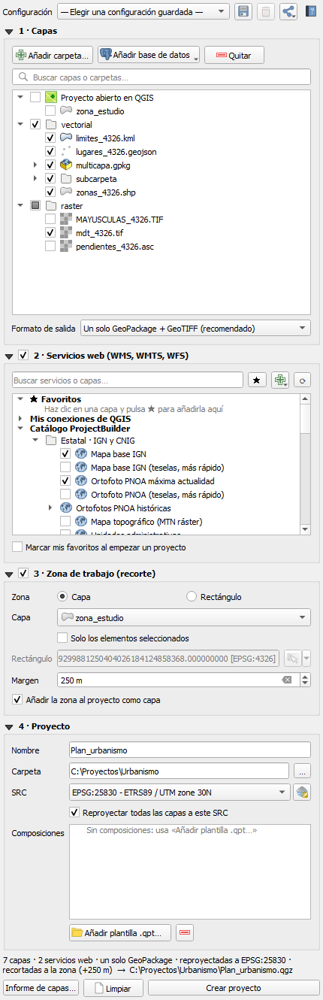

El panel se lee de arriba abajo, en el orden en que se trabaja:

| Parte | Para qué sirve |
|---|---|
| **Configuración** (arriba) | Rellenar todo el panel de una vez con una configuración guardada, guardar la actual, compartirla y abrir este manual (**?**). |
| **1 · Capas** | Elegir qué capas llevará el proyecto: de carpetas, del proyecto abierto o de bases de datos. Formato de salida. |
| **2 · Servicios web** | Añadir capas WMS, WMTS o WFS. |
| **3 · Zona de trabajo** | Recortar todo a una zona, con un margen. |
| **4 · Proyecto** | Nombre, carpeta, sistema de referencia y composiciones de impresión. |
| **Abajo** | Barra de avisos, resumen en vivo de lo que se va a generar y los botones *Informe de capas…*, *Limpiar* y *Crear proyecto*. |

Las secciones se pliegan y despliegan con el triángulo de su título. Las secciones 2 y 3 tienen una casilla: si está desmarcada, esa parte no se usa.

**Avisos:** los errores y avisos salen en la barra verde, naranja o roja que hay encima de los botones, sin ventanas que interrumpan. Si el aviso es largo, se ve la primera línea y el resto con el botón *Más*. Se cierran con la ✖.

---

## 3. Configuraciones guardadas y cómo compartirlas

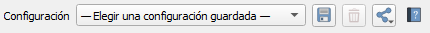

Si haces a menudo el mismo tipo de proyecto, guarda el panel como **configuración**. Se guarda casi todo:
- las carpetas, capas y tablas marcadas;
- los servicios web;
- el formato de salida, el SRC y la reproyección;
- la zona de trabajo;
- las composiciones.

El nombre y la carpeta del proyecto no se guardan, porque cambian cada vez.

| Botón | Qué hace |
|---|---|
| Desplegable | Elige una configuración y el panel se rellena solo. Si algo ya no existe (una carpeta que se ha movido, una tabla borrada…), avisa de qué falta y carga el resto. |
| 💾 Guardar | Guarda el panel tal como está. Pide un nombre; si ya existe, pregunta antes de sustituirla. |
| 🗑 Borrar | Borra la configuración elegida (pregunta antes). |
| **Compartir** | Abre el menú de la imagen de abajo. |
| **?** | Abre este manual. |

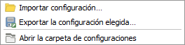

- **Importar configuración…:** elige un fichero `.json` (de un compañero, de otro ordenador…). Se añade a tus configuraciones y se carga en el panel. Si ya tienes una con el mismo nombre, se guarda como «Nombre (2)», sin pisar la tuya.
- **Exportar la configuración elegida…:** guarda una copia `.json` donde quieras, para enviarla por correo o dejarla en una carpeta compartida.
- **Abrir la carpeta de configuraciones:** abre la carpeta donde están todas.
- **Arrastrar:** también puedes **arrastrar un `.json` de configuración al panel** para importarlo.

**¿Dónde se guardan?** Cada configuración es un fichero `.json` en la carpeta del plugin dentro de tu perfil de QGIS, que se conserva al actualizar el plugin:
- QGIS 3: `C:\Users\<usuario>\AppData\Roaming\QGIS\QGIS3\profiles\default\project_builder\configuraciones`
- QGIS 4: lo mismo, cambiando `QGIS3` por `QGIS4`.
- Linux y macOS: la carpeta equivalente del perfil de QGIS. La forma más rápida de llegar a ella es *Compartir → Abrir la carpeta de configuraciones*.

> **Al compartir:** la configuración guarda las **rutas** de las capas. Funciona tal cual si tu compañero tiene acceso a las mismas rutas (por ejemplo, una unidad de red como `S:\Cartografía`). Si no, el plugin le avisa de lo que no encuentra y carga el resto.

---

## 4. Sección 1 · Capas

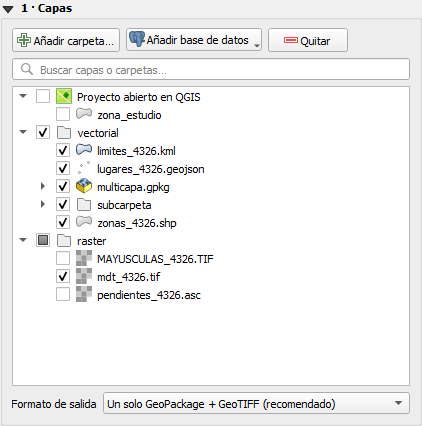

### 4.1 De dónde pueden venir las capas
- **Proyecto abierto en QGIS:** aparece siempre arriba del árbol, con los mismos grupos que el panel Capas de QGIS. Las capas se copian **con su estilo actual**, y las que tienen un filtro aplicado se copian filtradas. Los servicios web se añaden tal cual, sin copiar datos. Si abres otro proyecto en QGIS, el bloque se actualiza solo.
- **Carpetas:** pulsa **Añadir carpeta…** (tantas veces como orígenes tengas). Cada carpeta aparece con todas sus subcarpetas y las capas que el plugin puede leer:
  - **Vectoriales:** Shapefile, GeoPackage, SpatiaLite, GeoJSON, KML, GML, FlatGeobuf, MapInfo (TAB/MIF), DXF y GPX.
  - **Ráster:** GeoTIFF, ECW, JPEG2000, ASCII Grid, IMG, VRT, PNG/JPG georreferenciados y MrSID.
  - Los GeoPackage y demás ficheros con varias capas se despliegan para elegir capas sueltas.
- **Bases de datos:** pulsa **Añadir base de datos** y elige una de tus conexiones de QGIS:

  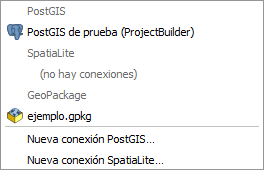

  - **Qué se ve:** salen sus esquemas y tablas con geometría, incluidas las vistas.
  - **Qué se descarga:** solo lo que cae en la zona de trabajo, si la hay.
  - **Estilo:** se conserva el guardado en la base de datos.
  - **Conexión nueva:** si no tienes la conexión, créala desde el mismo menú (*Nueva conexión PostGIS…* o *SpatiaLite…*).

### 4.2 Arrastrar carpetas y ficheros
Puedes **arrastrar** carpetas o ficheros al panel desde el Explorador de Windows (o el gestor de archivos) o desde el Navegador de QGIS. Mientras arrastras, el árbol se marca con un borde discontinuo.

- **Carpeta:** entra con todo su contenido, como con *Añadir carpeta…*.
- **Fichero suelto:** aparece bajo su carpeta y **ya marcado**. Solo entra ese fichero, no el resto de la carpeta, para que no se llene el árbol si arrastras algo del Escritorio.
- **Shapefile con todos sus ficheros** (`.shp`, `.dbf`, `.prj`…): cuenta como una sola capa.
- **Una capa de un GeoPackage desde el Navegador de QGIS:** se marca solo esa capa.
- **Plantillas `.qpt`:** van a las composiciones (apartado 7).
- **Configuraciones `.json`:** se importan (apartado 3).
- **Lo que no es una capa:** se avisa.
- **Si sueltas una carpeta que contiene otra que ya estaba en el árbol:** se integran, sin perder lo marcado.

### 4.3 Elegir capas
- Marca la casilla ☑ de cada capa. Marcar una carpeta marca todo su contenido; si solo hay una parte marcada, su casilla queda a medias.
- La caja **Buscar capas o carpetas** filtra el árbol mientras escribes, sin distinguir mayúsculas ni tildes.
- **Quitar** (o clic derecho → *Quitar … del árbol*) quita la carpeta o base de datos en la que has hecho clic. No borra nada del disco.

### 4.4 Información, «Ver en el mapa» y clic derecho
Al **pasar el ratón** por una capa ves su ruta, su SRC, el tipo de geometría y el número de elementos (o los píxeles y bandas si es ráster) y su tamaño:

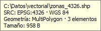

En las carpetas y GeoPackages, el recuadro dice cuántas capas contienen.

Con **doble clic** en una capa, o **clic derecho → Ver en el mapa**, el mapa de QGIS va a esa capa y su extensión parpadea en rojo. La capa no se añade al proyecto abierto. Sirve para comprobar dónde cae cada capa antes de elegirla.

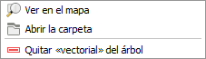

El mismo menú permite **abrir la carpeta** de la capa en el Explorador y **quitar** su carpeta del árbol.

### 4.5 Formato de salida

| Opción | Resultado |
|---|---|
| **Un solo GeoPackage + GeoTIFF** (recomendado) | Todas las capas vectoriales como tablas de `<nombre>.gpkg`, con sus estilos dentro. Los ráster en GeoTIFF comprimido. Es lo más cómodo para mover o enviar el proyecto. |
| **Un GeoPackage por capa + GeoTIFF** | Cada capa vectorial en su propio `.gpkg`, con la misma estructura de carpetas que el origen. |
| **Conservar el formato original** | Cada capa en su formato. Lo que GDAL no puede escribir (ECW, MrSID, DXF, GPX…) se convierte igualmente, y los ficheros con varias capas salen en GeoPackage. |

En todos los casos se conserva la simbología de las capas: sus estilos `.qml`, los guardados dentro de los GeoPackage o de la base de datos, y los iconos SVG que usan (ver el [apartado 10](#10-estilos-simbología-e-iconos-qml-y-svg)). **Los datos de origen nunca se modifican.**

---

## 5. Sección 2 · Servicios web

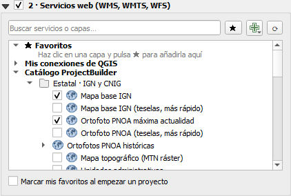

Activa la casilla de la sección para añadir capas WMS, WMTS o WFS. En el proyecto irán en un grupo «Servicios web». Hay tres bloques:
- **★ Favoritos:** tus capas de uso habitual. Selecciona una capa y pulsa **★** para añadirla o quitarla. Con *Marcar mis favoritos al empezar un proyecto*, salen ya marcados.
- **Mis conexiones de QGIS:** las conexiones WMS/WMTS y WFS que tengas en QGIS. Despliega una para ver sus capas. Con **+** creas una conexión nueva.
- **Catálogo ProjectBuilder:** servicios oficiales españoles (IGN y CNIG, Catastro, IGME, comunidades autónomas…), por organismo.

**Usar la sección:**
- La caja de búsqueda filtra los servicios mientras escribes.
- **⟳** vuelve a leer las conexiones y comprueba ahora todos los servicios.

**Servicios siempre al día:** una vez por semana, en segundo plano, el plugin comprueba que los servicios responden.
- Los que fallan se desactivan temporalmente y se marcan con ⛔.
- Corrige los cambios de dirección más habituales y descarga la última versión del catálogo.
- Si un favorito tuyo no responde, te avisa.

Con zona de trabajo, las capas WFS solo descargan esa zona.

---

## 6. Sección 3 · Zona de trabajo

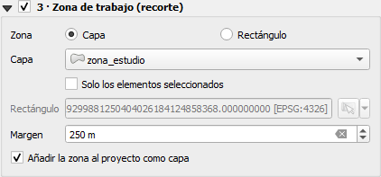

Activa la casilla para **recortar todas las capas** (vectoriales y ráster) a una zona. Tienes dos formas de definirla:
- **Capa:** una capa de polígonos abierta en QGIS. Con *Solo los elementos seleccionados*, se usan solo los polígonos seleccionados (por ejemplo, un término municipal).
- **Rectángulo:** con el botón de la derecha eliges la extensión actual del mapa, la de una capa, o dibujas el rectángulo en el mapa.

**Opciones:**
- **Margen:** amplía la zona los metros indicados (0 = sin margen).
- **Añadir la zona al proyecto como capa:** incluye el contorno de la zona, en rojo discontinuo y por encima de todo.

**Cómo se recorta:**
- Los vectoriales se cortan por el borde de la zona.
- Los ráster se recortan por máscara.
- Las capas que no tienen nada dentro de la zona **no se añaden**, y se indica en el informe final.
- El proyecto se abre ya centrado en la zona.

---

## 7. Sección 4 · Proyecto

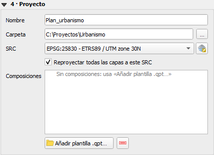

- **Nombre:** el del fichero `.qgz` y del GeoPackage. También es el título del proyecto.
- **Carpeta:** dónde se crea. Si no existe, se crea.
  - **Recomendación:** usa una carpeta **vacía y propia para cada proyecto** (por ejemplo `C:\Proyectos\Urbanismo`), no directamente *Descargas* o *Escritorio*.
  - No puede ser una de las carpetas de origen ni estar dentro de ellas, para no sobrescribir los datos originales.
- **SRC:** el sistema de referencia del proyecto. Con *Reproyectar todas las capas a este SRC*, todas las capas se transforman a él. Si lo desmarcas, cada capa conserva el suyo y QGIS las reproyecta al vuelo.
- **Composiciones:** composiciones de impresión que se añaden al proyecto, con sus mapas ya centrados en la zona de trabajo (o en todas las capas si no hay zona). Se pueden elegir:
  - las del **proyecto abierto en QGIS**;
  - **mis plantillas `.qpt`**: pulsa *Añadir plantilla .qpt…* o arrastra el fichero al panel;
  - las **plantillas del perfil de QGIS**.

  En el cajetín de la composición puedes escribir `[% @project_title %]`: se rellena con el nombre del proyecto.

---

## 8. Informe de capas (antes de crear)

El botón **Informe de capas…** muestra al instante lo que llevará el proyecto. Cada capa aparece con:
- su tipo y número de elementos;
- su superficie o longitud, en metros reales sobre el elipsoide;
- su SRC y su tamaño;
- ya recortada a la zona de trabajo, si la hay.

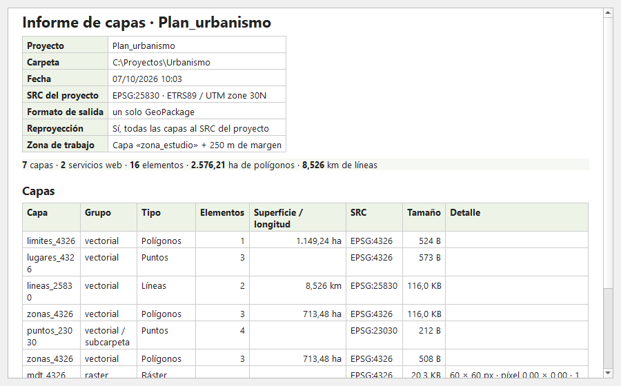

- **Guardar…:** en PDF (para imprimir o adjuntar a una memoria), HTML o CSV (para Excel).
- **Copiar:** copia la tabla para pegarla directamente en Excel o Word.

---

## 9. Crear el proyecto y el informe final

Debajo de las secciones, el **resumen en vivo** dice lo que se va a generar, por ejemplo: *7 capas · 2 servicios web · un solo GeoPackage · reproyectadas a EPSG:25830 · recortadas a la zona (+250 m) → C:\Proyectos\Urbanismo\Plan_urbanismo.qgz*.

Pulsa **Crear proyecto**:
- La copia se hace en **segundo plano**, con el progreso abajo a la derecha de QGIS. Puedes seguir trabajando o cancelarla desde ahí.
- Al terminar, el panel muestra el resultado: el número de capas, lo que ocupa el proyecto y cuánto ha tardado.

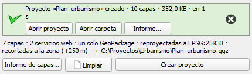

- **Abrir proyecto:** lo abre en QGIS (antes pregunta si quieres guardar el actual).
- **Abrir carpeta:** abre la carpeta del proyecto.
- **Informe…:** el informe completo. Incluye cada capa del proyecto creado con sus elementos, superficie y SRC, las capas que quedaron sin datos en la zona y los problemas, si los hubo. Se guarda o se copia igual que el informe de capas.

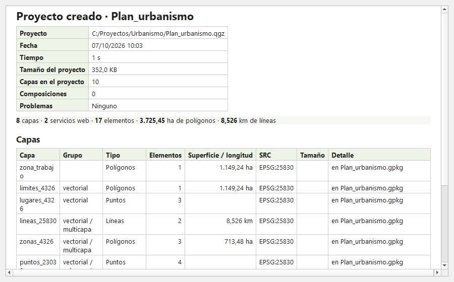

Si algo no se ha podido hacer (una capa ilegible, un icono que no aparece, un servicio que no responde…), el mensaje sale en **naranja** con «⚠ N problemas», y el detalle está en el informe. El proyecto se crea igualmente con todo lo demás.

**Limpiar** vacía el formulario para empezar otro proyecto.

---

## 10. Estilos, simbología e iconos (.qml y .svg)

El proyecto creado se ve con la **misma simbología** que las capas de origen: colores, clasificaciones, etiquetas, iconos… El plugin la recoge de donde esté y la guarda dentro del propio proyecto.

### 10.1 De dónde toma el estilo cada capa

| Origen de la capa | Estilo que se usa |
|---|---|
| **Fichero de una sola capa** (Shapefile, GeoJSON, KML, GeoTIFF…) | El fichero `.qml` que esté a su lado **con el mismo nombre**: `rios.shp` → `rios.qml`. |
| **Capa dentro de un GeoPackage o SpatiaLite** | El estilo guardado **dentro** del fichero (el que QGIS guarda con *Propiedades → Estilo → Guardar en la base de datos*). Si el GeoPackage tiene varias capas, un `.qml` a su lado no se usa, porque no se sabe a cuál de ellas corresponde. |
| **Capa del proyecto abierto en QGIS** | Su **estilo actual**, tal como la ves en el mapa en ese momento, aunque no lo hayas guardado. |
| **Tabla de PostGIS, SpatiaLite o GeoPackage conectado** | El estilo guardado en la base de datos (tabla `layer_styles`) como estilo por defecto. |
| **Servicio web** | El del propio servicio. |
| **Zona de trabajo** | Contorno rojo discontinuo, sin relleno. |

Si una capa no tiene ningún estilo, QGIS le asigna uno por defecto, como al abrirla a mano.

> **Consejo:** para que tus capas de carpeta salgan siempre con tu simbología, guárdala una vez en QGIS con *Propiedades de la capa → Estilo → Guardar como archivo de estilo de capa QGIS*, con el mismo nombre que la capa y en la misma carpeta.

### 10.2 Dónde queda guardado el estilo en el proyecto
- **Un solo GeoPackage (recomendado):** el estilo de cada capa se guarda **dentro del GeoPackage** del proyecto, como estilo por defecto, y además en el `.qgz`. Si alguien abre ese GeoPackage en otro proyecto, las capas salen ya con su simbología.
- **Un GeoPackage por capa o formato original:** el estilo va en el `.qgz` y, si la capa de origen tenía `.qml`, se copia también a su lado en la carpeta del proyecto.

### 10.3 Iconos SVG e imágenes: la carpeta `iconos\`
Muchas simbologías usan **iconos**: marcadores SVG (una farola, un árbol, un hidrante…), rellenos con patrón SVG o imágenes PNG/JPG. El estilo solo guarda la **ruta** del icono, no el icono. Si esa ruta es de tu ordenador (`D:\Cartografia\iconos\farola.svg`), en otro ordenador el símbolo saldría como un signo de interrogación.

Por eso, al crear el proyecto, ProjectBuilder:
1. **Busca** todos los iconos que usan las capas del proyecto, incluidos los de símbolos compuestos y los de reglas o categorías.
2. **Los copia** a la carpeta `iconos\` del proyecto.
3. **Cambia la ruta** de cada símbolo para que apunte a la copia, con ruta relativa. También lo hace en el estilo guardado dentro del GeoPackage.

Así el proyecto es **autónomo**: puedes mover la carpeta, enviarla o abrirla en otro ordenador, y los iconos se siguen viendo.

**Detalles:**
- **Iconos que trae QGIS de serie** (la biblioteca SVG de QGIS): no se copian, porque existen en cualquier instalación de QGIS.
- **Dos iconos distintos con el mismo nombre:** se guardan los dos, el segundo como `nombre_2.svg`, para que ningún símbolo cambie de aspecto.
- **Iconos incrustados en el estilo o de internet:** se dejan como están.
- **Si la ruta guardada ya no existe** (el estilo viene de otro ordenador, por ejemplo), el plugin **busca el icono por su nombre** en estos sitios:
  - las carpetas de capas añadidas al árbol, con sus subcarpetas, y la carpeta de encima de cada una (donde suelen ir las carpetas de iconos que acompañan a la cartografía);
  - la carpeta del proyecto abierto en QGIS;
  - las carpetas SVG configuradas en QGIS (*Configuración → Opciones → Sistema → Rutas SVG*).
- **Si aun así no aparece,** la capa se añade igual, y el informe final lo indica como problema: *«No se encuentra el icono farola.svg (capa alumbrado)»*. Basta con copiar ese icono junto a las capas de origen y volver a crear el proyecto.

> **Consejo:** si trabajas con una biblioteca de iconos propia (la de tu empresa, la de un cliente…), añade su carpeta en *Configuración → Opciones → Sistema → Rutas SVG* de QGIS. El plugin la tendrá en cuenta al buscar los iconos que falten.

---

## 11. Qué contiene la carpeta del proyecto

Con el formato recomendado (un solo GeoPackage):

```
Urbanismo\
├── Plan_urbanismo.qgz      ← el proyecto (rutas relativas: se puede mover la carpeta entera)
├── Plan_urbanismo.gpkg     ← todas las capas vectoriales, sus estilos y la zona de trabajo
├── raster\                 ← los ráster en GeoTIFF, con la misma estructura de carpetas que el origen
│   ├── mdt_4326.tif
│   └── mdt_4326.qml        ← su estilo, si la capa de origen tenía .qml
└── iconos\                 ← los iconos SVG o imágenes que usan los estilos (si los hay)
    ├── farola.svg
    └── arbol.svg
```

Con *Un GeoPackage por capa* o *Conservar el formato original*, cada capa vectorial está en su propio fichero, dentro de una carpeta por cada carpeta de origen, con su `.qml` al lado si lo tenía.

- **Proyecto autónomo:** no depende de las carpetas de origen. Puedes copiar la carpeta a otro ordenador, a un USB o a un compañero, y se verá exactamente igual, con los iconos y los estilos incluidos.
- **Servicios web:** no se descargan; se añaden como conexión dentro del proyecto.
- **Capas de bases de datos:** quedan copiadas en el GeoPackage, como cualquier otra capa.

---

## 12. Preguntas frecuentes y problemas

**El informe dice que una capa «no tiene datos en la zona».**
No es un error: la capa no tiene ningún elemento dentro de la zona de trabajo (más el margen), así que no se añade. Revisa la zona o amplía el margen.

**«La carpeta del proyecto no puede ser una carpeta de capas ni estar dentro de ella».**
El destino está dentro de una de las carpetas de origen, y el plugin lo impide para no sobrescribir tus datos. Elige otra carpeta de destino.

**«No se puede sobrescribir <nombre>.gpkg».**
Ya existe un proyecto con ese nombre en esa carpeta y su GeoPackage está abierto, normalmente porque el proyecto está abierto en QGIS. Ciérralo o usa otro nombre.

**Aviso de «No se encuentra el icono…».**
El estilo de una capa usa un icono SVG que no está en tu ordenador. El plugin lo busca por su nombre en las carpetas de capas, en la del proyecto abierto y en las carpetas SVG de QGIS. Si no lo encuentra, la capa se añade igual, pero ese símbolo no se verá. Copia el icono junto a las capas y vuelve a crear el proyecto (ver el [apartado 10.3](#103-iconos-svg-e-imágenes-la-carpeta-iconos)).

**Una capa sale con otro estilo o con el de por defecto.**
Comprueba que su `.qml` se llama exactamente igual que la capa y está en la misma carpeta. En un GeoPackage, el estilo tiene que estar guardado dentro del fichero (ver el [apartado 10.1](#101-de-dónde-toma-el-estilo-cada-capa)). Si la capa viene del proyecto abierto, se usa el estilo que tenga en ese momento.

**Un servicio aparece con ⛔.**
No respondió en la última comprobación. Se vuelve a probar automáticamente; pulsa **⟳** para comprobarlo ahora.

**Al cargar una configuración avisa de que faltan cosas.**
Se ha movido o borrado alguna carpeta, capa o tabla desde que se guardó, o la configuración viene de otro ordenador con otras rutas. Se carga todo lo demás. Corrige el panel y guárdala de nuevo con 💾.

**¿Modifica mis datos originales?**
No. ProjectBuilder solo lee las capas de origen y escribe en la carpeta del proyecto.

---

¿Has encontrado un error o tienes una idea? Escríbela en [Issues](https://github.com/FGomezLosada/ProjectBuilder/issues).
